# Real-time data extraction from on-premises Oracle to MaxCompute

## Summary

0. [Abstract](#abstract)
1. [Introduction](#introduction)
2. [Tutorial](#tutorial)
3. [Support](#support)
4. [Conclusion](#conclusion)
5. [Support](#support)

## Abstract
This article discussing about how to extract and synchronize the data from on-premises Oracle to MaxCompute.
The article is written for software engineer or DBA or architect who already have a basic understanding of Alibaba Cloud MaxCompute, RDS for MySQL and VPC network components, and also have a basic knowledge of Oracle database.

## Introduction
In this article we will deploy an Oracle database 11.2.0.4.0(not RAC) in an ECS, which we take it as an existed Oracle database in customer production environment. We use data generator tool to mock data for testing. As DTS doesn’t currently support direct migrate data from Oracle database to MaxCompute, we need a MySQL(RDS) as a transit node in the target AlibabaCloud account. The migration process is divide into two phase, the data will firstly migrated from the origin database to the transit node, and then from transit node to MaxCompute, the architecture is like:

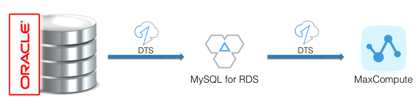

Note:
Data Integration provides another way for periodically data synchronization from Oracle to MaxCompute, but this method can only be used when the source table has a modification time field. [Read more.](https://www.alibabacloud.com/help/faq-detail/51305.html)

## Tutorial

### Set up On-Premise Origin Oracle Database

For deploying and installing Oracle database is not one of the topics that the article is going to discuss, but you can follow the [Oracle document](http://www.oracle.com/webfolder/technetwork/tutorials/obe/db/11g/r1/prod/install/dbinst/dbinst.htm) to install a Oracle Database 11g on an ECS.

Before migrate and synchronize the data from origin database to RDS for MySQL, we should make sure the origin DB already satisfies these prerequisites: [Migrate data from on-premises Oracle to RDS for MySQL](https://www.alibabacloud.com/help/doc-detail/26620.htm)

​    1.Origin DB account:   SYSDBA   

​    2.Target DB privilege: Write/Read      

​    3.Origin Oracle DB version is one of 10g,11g,12c.   

​    4.Oracle enable supplemental log, supplemental_log_data_pk and supplemental_log_data_ui。   

​    5.Oracle enable archive log module.   

 

- Firstly, connect to Oracle database using sysdba account, and setup instance:

```shell
[oracle@oracle11g ~]$ sqlplus / as sysdba

SQL> **shutdown immediate;**

Database closed.

Database dismounted.

ORACLE instance shut down.

 

SQL> **startup mount;**

ORACLE instance started.

 

Total System Global Area 1.2549E+10 bytes

Fixed Size                 12155024 bytes

Variable Size            6744442736 bytes

Database Buffers         5771362304 bytes

Redo Buffers               21397504 bytes

Database mounted.

 

SQL> **alter database archivelog;**

 

Database altered

 

SQL> **alter database open;**

 

Database altered
```

 

- Use Data Generator generate mock data and insert into Oracle database


For this demo, we mock a user table t_user:

```sql
CREATE TABLE "GEOFFREY"."T_USER" 

   (     "ID" NUMBER(10,0) NOT NULL ENABLE, 

         "ADDR" VARCHAR2(35 BYTE), 

         "GMT_MODIFIED" DATE NOT NULL ENABLE, 

         CONSTRAINT "T_USER_PK" PRIMARY KEY ("ID")

  USING INDEX PCTFREE 10 INITRANS 2 MAXTRANS 255 COMPUTE STATISTICS 

  TABLESPACE "TEST_DATA"  ENABLE

   ) SEGMENT CREATION DEFERRED 

  PCTFREE 10 PCTUSED 40 INITRANS 1 MAXTRANS 255 

 NOCOMPRESS LOGGING

  TABLESPACE "TEST_DATA" ;
```

- And generate up to 1M rows of test data to the table:


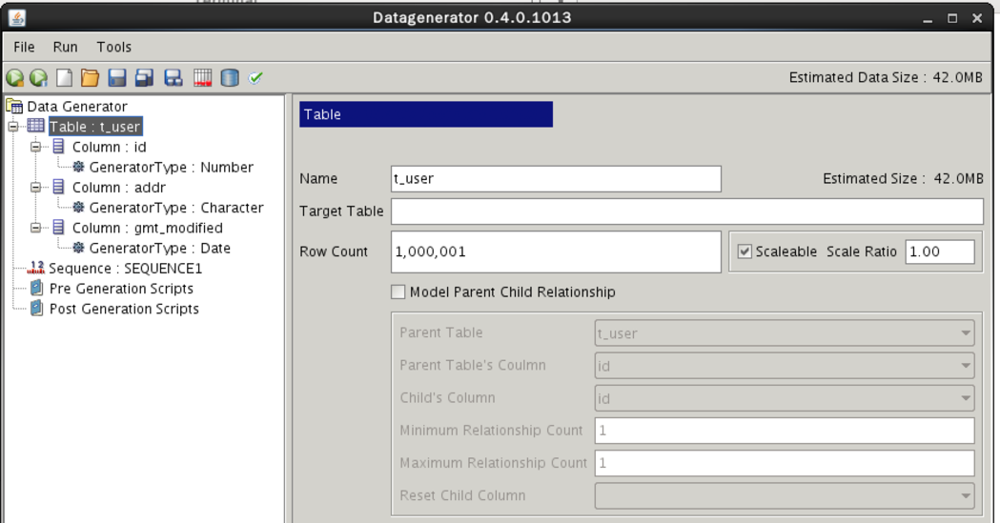

Now we have 1 million mocked rows in t_user table.

 

### Set up Transit Database in RDS for MySQL

​    1.Purchase a RDS for MySQL 5.6 database from [RDS console](https://rdsnext.console.aliyun.com/#/rdsList/cn-hangzhou/basic/), the MySQL instance below will be as the instance to transit the data from Oracle to MaxCompute:

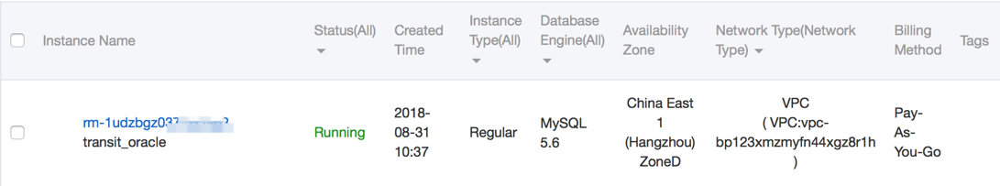

​    2.Create a migration account in the transit node, in this case we created normal type of account named dba_mgr: 

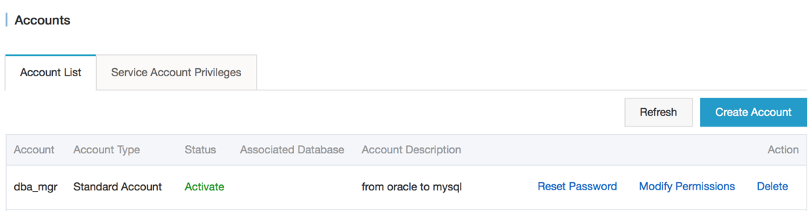

​    3.Create the target database(db_1) from the console and grant the read write privilege to the account we created from step above:

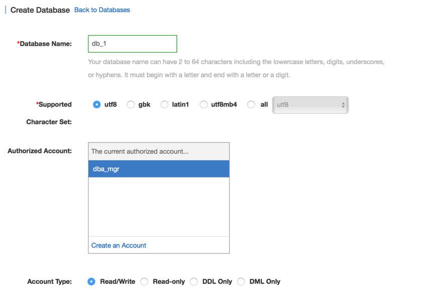

### Setup DTS migration Task

Go to the DTS console with the same account of the RDS for MySQL, and create migration task named oracle2mc

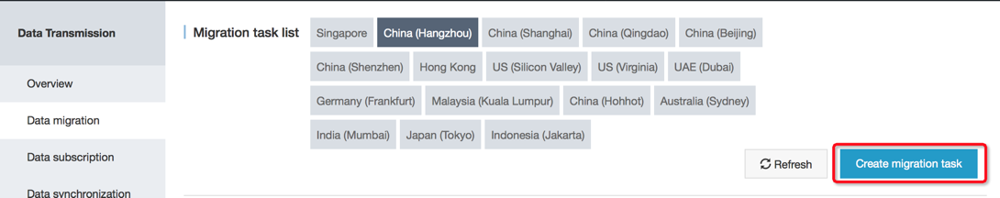

Step 1: Setup the oracle connection string and account in the console,

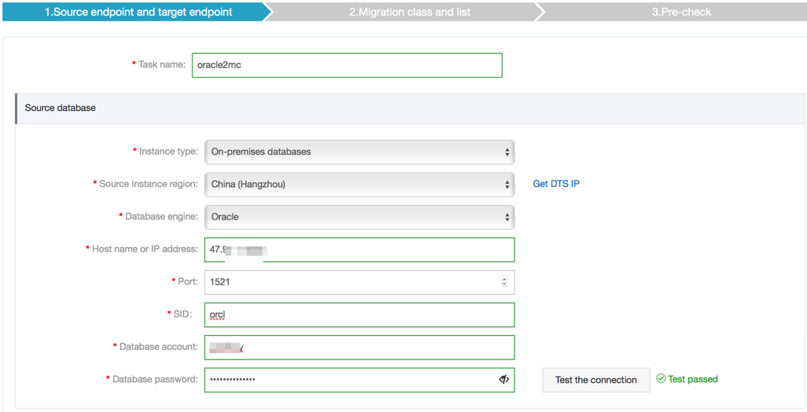


 

Previous to next step, we run ‘Test the connection’ in order to get rid of any connection issues. 

 

Step 2: Specify the source objects you want to apply in the task from Migration objects box, also check Migrate object structure, Migrate existing data and Replicate data changes:

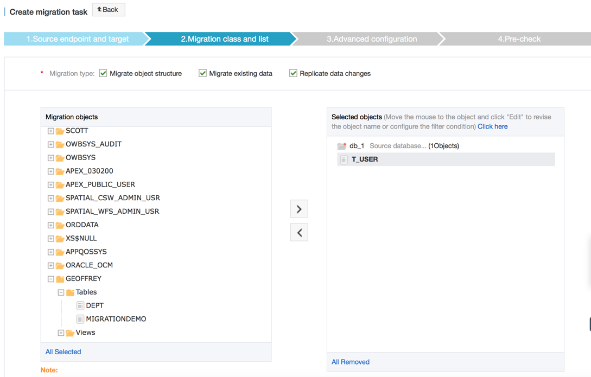

**Note:**

​    1.Data migration only copies data and structure from source database to target database, it has no influence on source database.

​     2.DDL operations are not allowed during the process of data migration. Otherwise, the migration task may fail.

To change the target object name, we can also edit in the box on the Selected objects box:

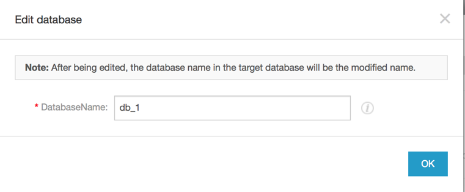

It’s really convenient when we need to filter out any column from the source table:

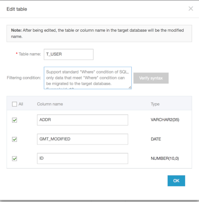

 

Step 3. Check new column option in order to ensure the consistency of data synchronization in case that there are no primary key table. Then click the Pre-check and start button at the bottom left, and wait for the pre-check process:

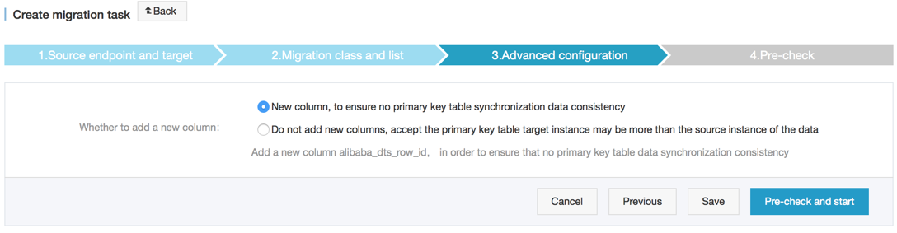 

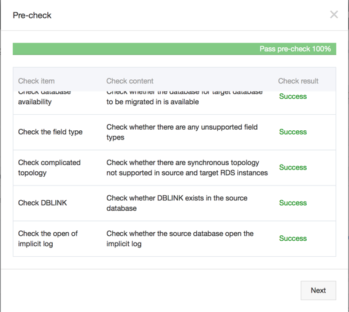

Fortunately, we passed all the check items. Now, let’s purchase and start the migration task:

 

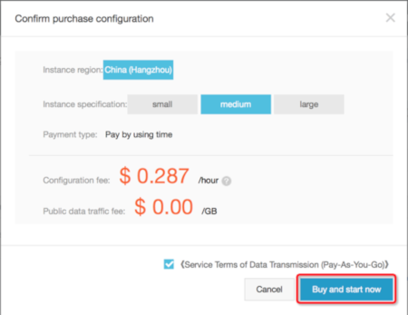

Starting migrate:

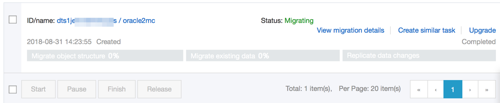

Finished existing data migration and keep on replicating :

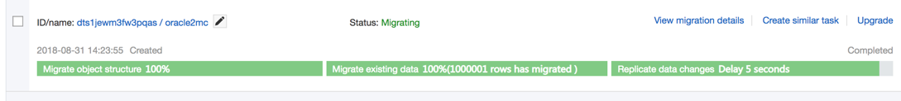

###  Set up target MaxCompute warehouse 

Create MaxCompute project from [DataWorks console:](https://workbench.data.aliyun.com/consolenew#/projectlist)

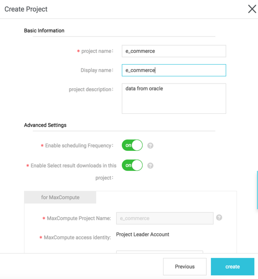

Now we have a new MaxCompute project named ‘e_commerce’:

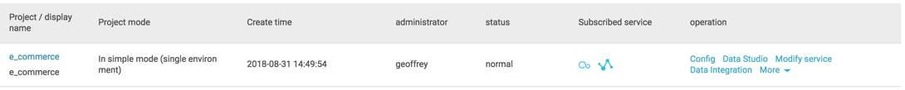

 

### Set up Data Synchronization task for DTS

​    1.Go to DTS console and Create Synchronization task: 

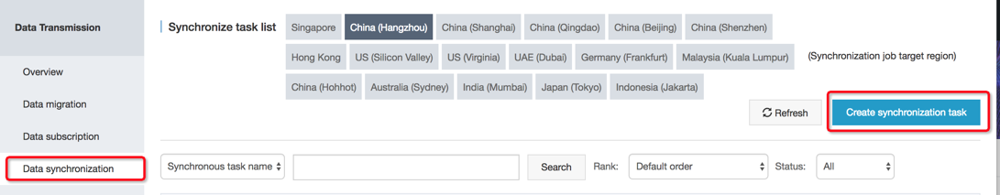

 

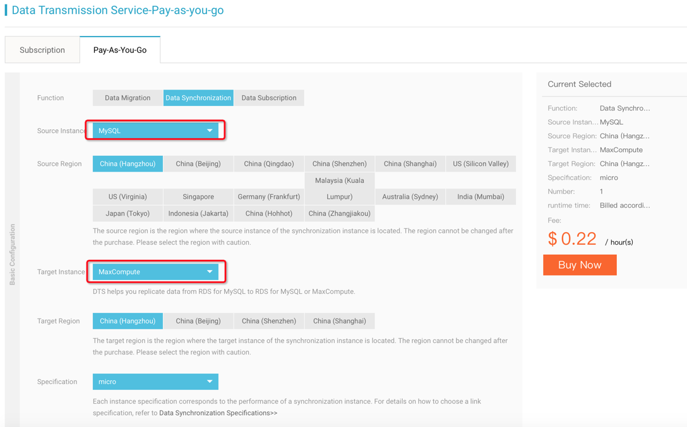

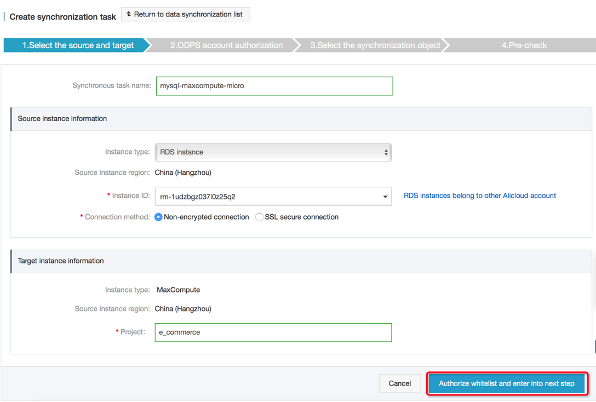

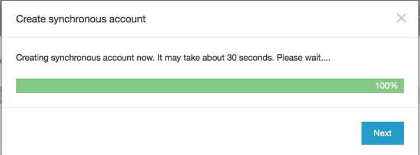

​    2.In this step, you need not to authorize manually, DTS will handle it:

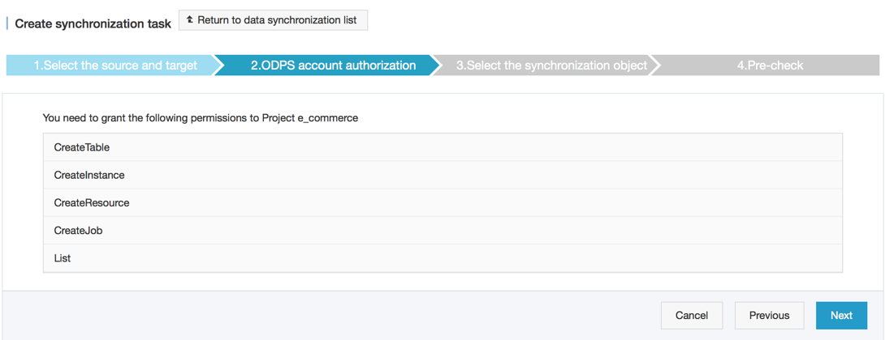

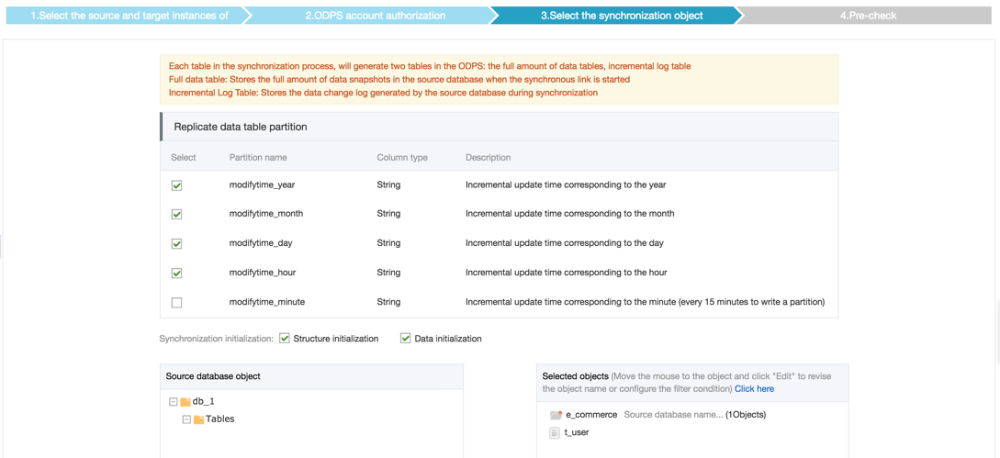

​    3.After configured the data transmission task successfully, there will be a synchronization task in the list:

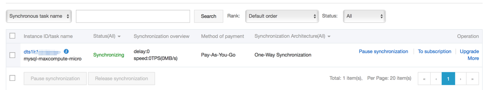

 

​    4.Let’s wait here until the Data Initialization task completed:

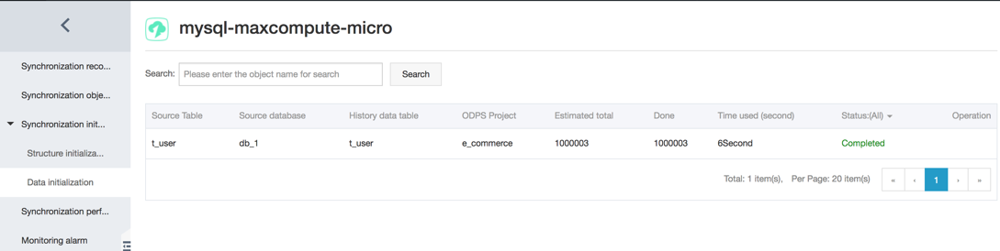

​    5.Now we may switch to DataWorks console to verify whether the data sources had been synchronized successfully:

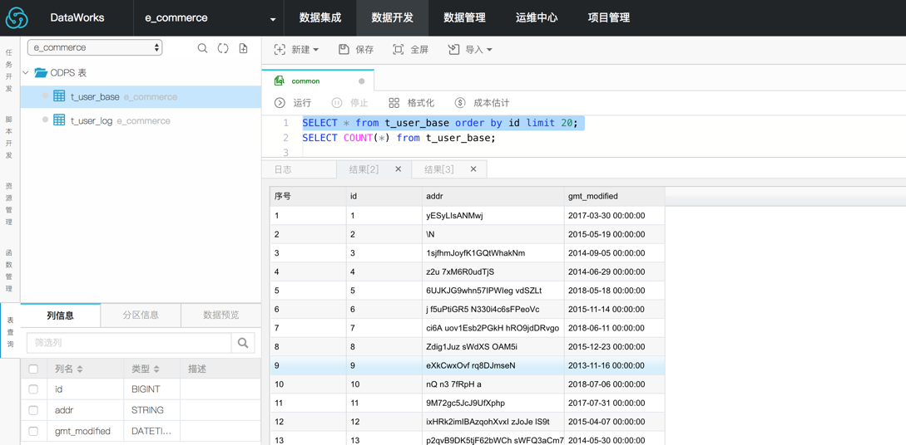

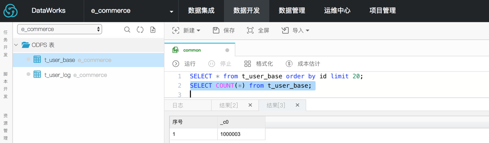

 

### Merge log table data into full data table

This section describes how to get the full data of table for a specific time based on the base table and incremental log data which synchronized to MaxCompute. DTS provides the ability to achieve full data merging with MaxCompute SQL.

The full data at time 't' is obtained by MaxCompute SQL which merge from base table and log table. MaxCompute SQL is written as follows:

```sql
INSERT OVERWRITE TABLE t_user
SELECT  id
        ,addr
        ,gmt_modified
FROM    (
            SELECT  ROW_NUMBER() OVER(PARTITION BY t.id ORDER BY record_id DESC, after_flag DESC) AS row_number
                    ,record_id
                    ,operation_flag
                    ,after_flag
                    ,id
                    ,addr
                    ,gmt_modified
            FROM    (
                        SELECT  incr.record_id
                                ,incr.operation_flag
                                ,incr.after_flag
                                ,incr.id
                                ,incr.addr
                                ,incr.gmt_modified
                        FROM    t_user_log incr
                        WHERE   utc_timestamp < unix_timestamp(dateadd(GETDATE(), -8, 'HH'))
                        AND     modifytime_year <= TO_CHAR(GETDATE(), 'yy')
                        UNION ALL
                        SELECT  0 AS record_id
                                ,'I' AS operation_flag
                                ,'Y' AS after_flag
                                ,base.id
                                ,base.addr
                                ,base.gmt_modified
                        FROM    t_user_base base
                    ) t
        ) gt
WHERE   gt.row_number = 1
AND     gt.after_flag = 'Y'
;
```

You can also use the Dataworks to add a  Merge nodes before subsequent computational analysis operations. When the full data merge is completed, subsequent computational analysis nodes can be automatically scheduled. At the same time, the scheduling period can be configured to perform periodic data offline analysis.


## Conclusion

Up to now, we already finished the data migration & synchronization tasks from Oracle to MaxCompute, now we completes the MySQL database data synchronization to MaxCompute and full data merge.


## Support
Don't hesitate to [contact us](mailto:projectdelivery@alibabacloud.com) if you have questions or remarks.


